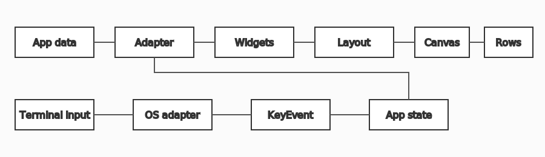

Architecture
============

Responsibility boundaries
-------------------------

Widgets describe presentation and draw within rectangles. Layout containers assign rectangles to
children. ``Canvas`` owns fixed-size cells and clipping. The renderer creates a canvas and returns
rows or text. The terminal layer reads dimensions and color capability but never clears or prints.

Event flow
----------

Future Windows and Linux adapters translate terminal input into ``KeyEvent``. The application
updates its own focus, selection, collapse, and persistence state, rebuilds the widget tree, then
renders another complete frame. Modifier-free commands remain mandatory fallbacks.

Student TUI adapter
-------------------

The future adapter lives in ``2cornot2c``, not in this package. It maps assignment-detail,
workspace, activity, allowed-help, help-request, report, test, grading, runner, and quick-guide
dictionaries to widgets. Existing ``.student-lab-layout.json`` state remains owned by the
application.

The adapter must be compatible with ``scripts/student_lab_layout.py`` and preserve its ASCII,
optional ANSI, responsive, and Windows/Linux behavior. No application code or data model is copied
into this library.

Phase design records
--------------------

.. toctree::
   :maxdepth: 1

   phase-2-contracts
