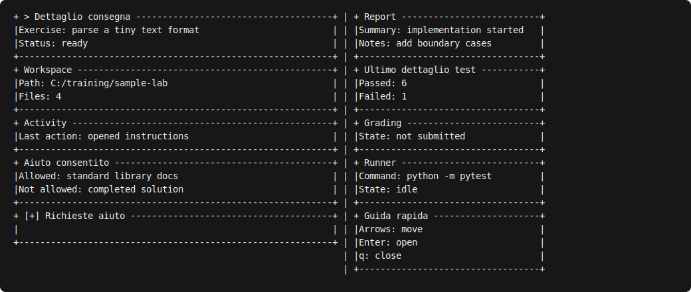
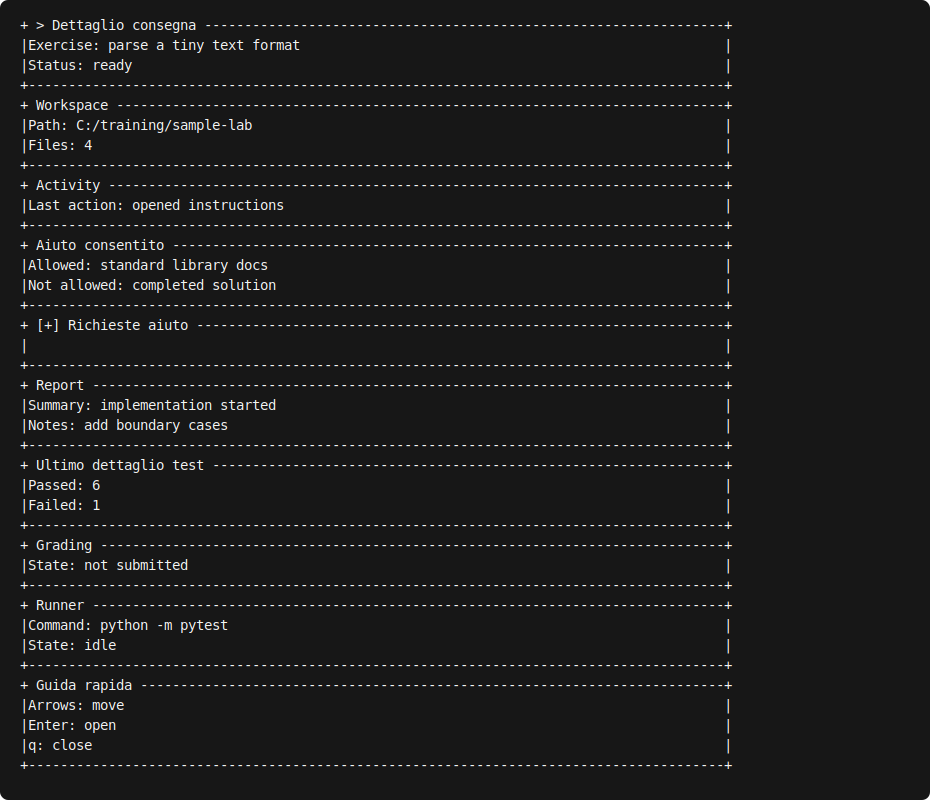
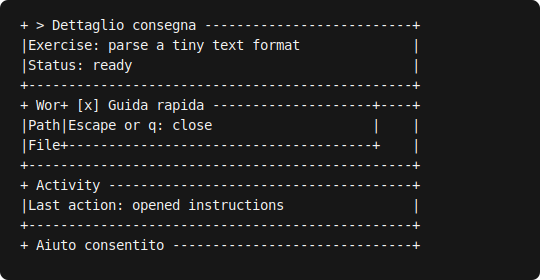

Examples
========

Three responsive panels
-----------------------

``examples/basic_panels.py`` builds assignment, activity, and test panels. Run it with:

.. code-block:: console

   python examples/basic_panels.py --no-color

The same widget tree renders side by side in a wide terminal and stacks when declared minimum
widths cannot fit. The application decides when to print the returned frame.

Dividers and status badges
--------------------------

``examples/divider_badges.py`` demonstrates both divider orientations and all semantic badge
states. Run it without ANSI styling with:

.. code-block:: console

   python examples/divider_badges.py --no-color

The ASCII markers retain meaning when color is disabled:

.. code-block:: text

   . queued
   i running
   + passed
   ! needs attention
   x failed

The example also composes a vertical divider through ``Row``. The application owns printing and
terminal color policy; the widgets only draw into the canvas.

Selectable list
---------------

``examples/selectable_list.py`` renders a focused ``ListView`` inside a ``Panel``. Run its stable
snapshot without ANSI styling with:

.. code-block:: console

   python examples/selectable_list.py --no-color

The example supplies ``active_index`` and ``scroll_offset`` directly. It intentionally has no key
reader or event loop: an application updates those values and rebuilds the widget tree.

Scrollable widget content
-------------------------

``examples/scroll_view.py`` renders explicit activity rows through an isolated ``ScrollView``.
Run its stable snapshot without ANSI styling with:

.. code-block:: console

   python examples/scroll_view.py --no-color

The application supplies both ``content_height`` and ``scroll_offset``. The example deliberately
avoids wrapped auto-measurement and contains no input loop.

Centered modal composition
--------------------------

``examples/modal.py`` draws a base workspace and then a centered ``Modal`` through a tiny
application-owned composite. Run the stable ASCII snapshot with:

.. code-block:: console

   python examples/modal.py --no-color

The example owns z-order and the ``open`` value. ``[x]`` is a textual affordance; there is no input
reader, callback, dimming layer, or event loop in the widget.

Terminal input and responsive redraw
------------------------------------

``examples/terminal_input.py`` is an application example, not a new framework layer. Its stable
snapshot mode builds three panels from caller-owned state and never opens standard input:

.. code-block:: console

   python examples/terminal_input.py --snapshot --no-color

Use ``--interactive`` only in a real Linux terminal or Windows console. The example enters
``KeyReader`` visibly, uses finite reads so ``ResizeWatcher`` can be polled, maps both semantic
keys and modifier-free commands, rebuilds the widget tree, and chooses when to replace the frame.
Its loop, commands, mutable state, clear/home sequences, and printing stay outside the library.

.. code-block:: console

   python examples/terminal_input.py --interactive --no-color

The portable command pairs are Up/``k``, Down/``j``, Tab/``n``, Enter/Space, and Escape/``q``.
Redirected input is rejected rather than reinterpreted as an interactive keyboard. See
:doc:`../architecture/phase-3-verification` for the exact manual protocol.

.. image:: ../_static/images/terminal-input.svg
   :alt: Three responsive ASCII panels showing terminal size, selected application item, and portable keyboard commands.
   :align: center

Student dashboard reference adapter
-----------------------------------

``examples/student_dashboard_adapter.py`` and
``examples/student_dashboard_fixtures.py`` make the Phase 4 integration contract executable
without importing the student application or adding package API. Run the synthetic dashboard at
the current terminal size with:

.. code-block:: console

   python examples/student_dashboard_adapter.py --no-color

The reference adapter consumes neutral logical rows plus normalized caller-owned ``orientation``,
``order``, ``left_width``, ``collapsed``, and ``focus`` state. At 90 columns or wider it renders
two groups of five panels separated by the compatibility string ``" | "``. Below that breakpoint,
or for explicit vertical orientation, it constructs one column in exact persisted order.

The fixture revision and helper names are example/test details, not stable imports. Real consumer
dictionaries, validation, persistence, commands, resize/redraw policy, and fallback remain in the
consumer repository.

Use explicit dimensions for reproducible captures:

.. code-block:: console

   python examples/student_dashboard_adapter.py --no-color --width 100 --height 20
   python examples/student_dashboard_adapter.py --no-color --width 89 --height 38

``PRESENTATION`` contains only the five persisted layout meanings. ``INTERACTION`` separately
contains caller-owned dashboard and section offsets, list offsets and selection, and modal
presentation. The adapter draws with effective clamps but never writes them back. The fixture
revision is ``phase4-v2``.

See :doc:`the integration guide <../integration/index>` and
:doc:`the Phase 4 evidence matrix <../architecture/phase-4-verification>` for the complete
ownership and verification boundaries.
