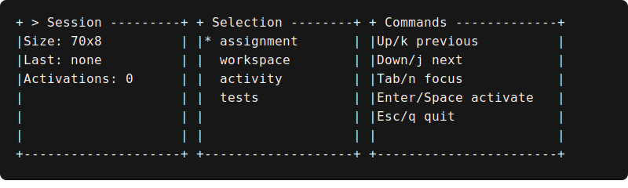

Examples
========

Three responsive panels
-----------------------

``examples/basic_panels.py`` builds assignment, activity, and test panels. Run it with:

.. code-block:: console

   python examples/basic_panels.py --no-color

The same widget tree renders side by side in a wide terminal and stacks when declared minimum
widths cannot fit. The application decides when to print the returned frame.

Dividers and status badges
--------------------------

``examples/divider_badges.py`` demonstrates both divider orientations and all semantic badge
states. Run it without ANSI styling with:

.. code-block:: console

   python examples/divider_badges.py --no-color

The ASCII markers retain meaning when color is disabled:

.. code-block:: text

   . queued
   i running
   + passed
   ! needs attention
   x failed

The example also composes a vertical divider through ``Row``. The application owns printing and
terminal color policy; the widgets only draw into the canvas.

Selectable list
---------------

``examples/selectable_list.py`` renders a focused ``ListView`` inside a ``Panel``. Run its stable
snapshot without ANSI styling with:

.. code-block:: console

   python examples/selectable_list.py --no-color

The example supplies ``active_index`` and ``scroll_offset`` directly. It intentionally has no key
reader or event loop: an application updates those values and rebuilds the widget tree.

Scrollable widget content
-------------------------

``examples/scroll_view.py`` renders explicit activity rows through an isolated ``ScrollView``.
Run its stable snapshot without ANSI styling with:

.. code-block:: console

   python examples/scroll_view.py --no-color

The application supplies both ``content_height`` and ``scroll_offset``. The example deliberately
avoids wrapped auto-measurement and contains no input loop.

Centered modal composition
--------------------------

``examples/modal.py`` draws a base workspace and then a centered ``Modal`` through a tiny
application-owned composite. Run the stable ASCII snapshot with:

.. code-block:: console

   python examples/modal.py --no-color

The example owns z-order and the ``open`` value. ``[x]`` is a textual affordance; there is no input
reader, callback, dimming layer, or event loop in the widget.

Terminal input and responsive redraw
------------------------------------

``examples/terminal_input.py`` is an application example, not a new framework layer. Its stable
snapshot mode builds three panels from caller-owned state and never opens standard input:

.. code-block:: console

   python examples/terminal_input.py --snapshot --no-color

Use ``--interactive`` only in a real Linux terminal or Windows console. The example enters
``KeyReader`` visibly, uses finite reads so ``ResizeWatcher`` can be polled, maps both semantic
keys and modifier-free commands, rebuilds the widget tree, and chooses when to replace the frame.
Its loop, commands, mutable state, clear/home sequences, and printing stay outside the library.

.. code-block:: console

   python examples/terminal_input.py --interactive --no-color

The portable command pairs are Up/``k``, Down/``j``, Tab/``n``, Enter/Space, and Escape/``q``.
Redirected input is rejected rather than reinterpreted as an interactive keyboard. See
:doc:`../architecture/phase-3-verification` for the exact manual protocol.

