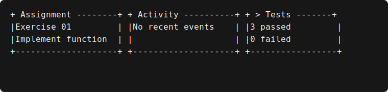

thebitlab-tui
=============

``thebitlab-tui`` is a small, dependency-free Python library for pure ASCII terminal rendering.
It targets Python 3.11+ on Windows and Linux without owning an event loop or application state.

.. toctree::
   :maxdepth: 2
   :caption: Guides

   user-guide/index
   developer-guide/index
   architecture/index
   examples/index
   api/index

Repository governance is documented separately in
``docs/it/00-regole-operative.md`` because it is contributor policy rather than library usage.
