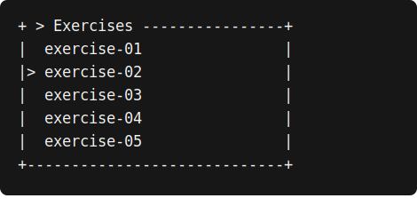
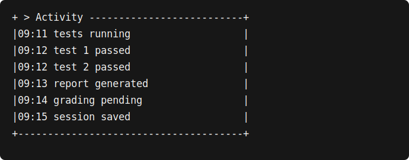
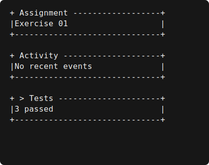

User guide
==========

Installation
------------

The library requires Python 3.11 or newer and has no runtime dependencies. During development it
can be installed from the repository with ``python -m pip install -e .``.

First frame
-----------

Widgets create a presentation tree; the renderer returns rows or a string. Printing remains an
application decision.

.. code-block:: python

   from thebitlab_tui import Panel, Row, render

   screen = Row([
       Panel("Exercise 01", title="Assignment", min_width=20),
       Panel("No recent events", title="Activity", min_width=20),
       Panel("3 passed", title="Tests", min_width=16),
   ])

   frame = render(screen, width=72, height=8, color=False)
   print(frame)

Widgets and layout
------------------

``Label`` draws text with left, center, or right alignment. It can wrap or truncate with ``...``.
``Panel`` adds an ASCII border, title, focus marker, and collapsed state. ``Row`` distributes width
using fixed or flexible ``Size`` values; ``Column`` distributes height.

When the minimum widths of a row no longer fit, its children stack vertically. If even the minimum
dimensions cannot fit, clipping prevents horizontal overflow.

Dividers and status badges
--------------------------

``Divider`` draws ``-`` horizontally or ``|`` vertically. A custom character must be one printable
ASCII cell. When a layout assigns more than one row or column, the line stays centered with any odd
spare cell below or to the right.

``StatusBadge`` keeps semantic state visible without color. The stable marker mapping is ``.`` for
neutral, ``i`` for information, ``+`` for success, ``!`` for warning, and ``x`` for error.
``style=None`` selects the semantic style: plain for neutral and bright blue, green, yellow, or red
for the colored states. An explicit ``Style`` overrides color but not the marker. At width one the
marker wins, and ``color=False`` removes ANSI without changing geometry.

.. code-block:: python

   from thebitlab_tui import Column, Divider, StatusBadge, render

   screen = Column([
       StatusBadge("running", status="info"),
       Divider(),
       StatusBadge("passed", status="success"),
   ])

   frame = render(screen, width=20, height=3, color=False)

Selection and ListView
----------------------

``ListView`` renders one string per row while the application owns focus, selection, and the
requested vertical offset. A focused active row starts with ``>`` followed by one space; an
unfocused active row starts with ``*`` followed by one space; inactive rows reserve the same two
columns. Width one keeps the marker, and item text uses the normal stable ellipsis behavior.

.. code-block:: python

   from thebitlab_tui import ListView, Panel, render

   state = {"active_index": 2, "scroll_offset": 1, "focused": True}
   listing = ListView(
       [
           "setup",
           "exercise-01",
           "exercise-02",
           "exercise-03",
           "exercise-04",
           "exercise-05",
       ],
       **state,
   )
   frame = render(Panel(listing, title="Exercises", focused=True), 28, 7)

Drawing clamps only the effective offset when the requested offset is beyond the last full
viewport. It does not change ``scroll_offset``, move the viewport to reveal ``active_index``, or
process keys. After input, the application computes new state and builds the next widget tree.

Arbitrary content and ScrollView
---------------------------------

``ScrollView`` clips a string or widget that is logically taller than its assigned rectangle. The
application supplies both the logical ``content_height`` and requested ``scroll_offset``; drawing
clamps an effective offset without changing either value. A viewport-sized temporary canvas keeps
child output out of adjacent layout cells, and ``Canvas.blit`` preserves character styles when the
result is composed.

.. code-block:: python

   from thebitlab_tui import Label, Panel, ScrollView, render

   lines = ["queued", "running", "test 1 passed", "test 2 passed", "done"]
   viewport = ScrollView(
       Label("\n".join(lines)),
       content_height=len(lines),
       scroll_offset=1,
   )
   frame = render(Panel(viewport, title="Activity"), width=28, height=6)

The initial contract has no horizontal scrolling or child measurement. Use explicit logical rows
as above. If an application wraps text according to terminal width, it must recalculate the
corresponding height before constructing the next frame.

Color and terminals
-------------------

Pass ``color=True`` only after applying the application's terminal policy. Pass ``color=False``
for ``--no-color``. ANSI styling is attached to canvas cells and is excluded from visible-width
calculations. ``render_terminal`` reads the size on every invocation, while ``ResizeWatcher``
reports changes without installing signals or an event loop.

Always provide keyboard commands without Alt or Ctrl when input adapters are added: those
modifiers are not transmitted consistently by every Windows terminal.

